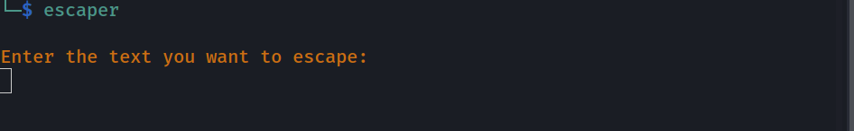
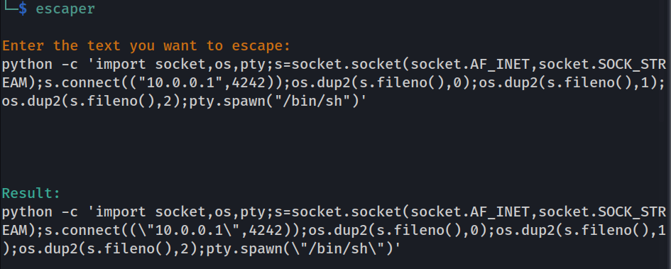

# ESCAPER 
---

This is simple python script which modify the string by escaping special characters which have special meaning for bash/zsh and other shells. Mainly useful when you want send payloads through **curl** or execute any command with ready exploit by passing it through terminal.

### Installation 
First clone the repository to your machine.
```
git clone 
```
Then move to the cloned directory
```sh
cd escaper 
```

And run **setup.py** to install this to your bin directory to use it even outside of this directory
```
sudo python3 setup.py
```
> REMINDER: do not forget to run **setup.py** with sudo privileges


### Usage
Just execute the command. It will prompt the input with the string you want to escape 



Output is the escaped string which you can use within double quotes without any problems.

